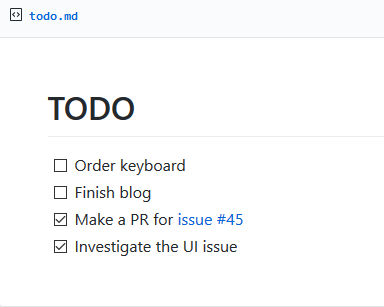
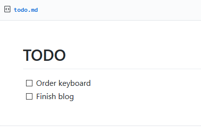
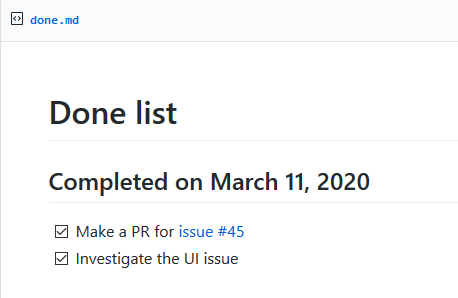
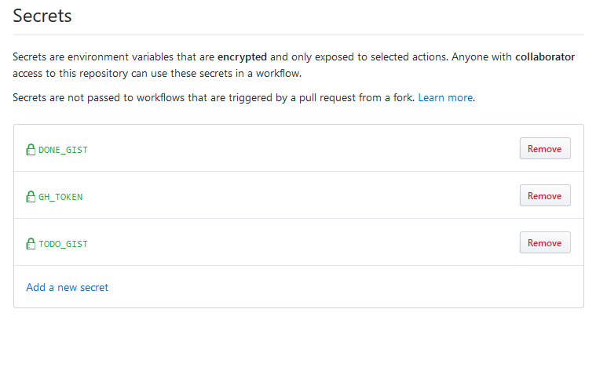

# Todo List using GitHub Gist

## Features

### Before

Create a Todo List in a GitHub Gist (following the task list syntax) and
create a list and check the off during the day.

### After

After midnight your done tasks will be transferred to the done list. In this
way you will have a history of your list!

| Todo | Done |
|----------------------------|--------------------------:
|  |  |

## Usage

- First create two gists, namely `todo` and `done`. Add file `todo.md` and
  `done.md` to them respectively. The file content should be a single header
  `# TODO` and `# Done` respectively.

- Generate a new personal access token with gist scope from
  here: <https://github.com/settings/tokens/new>.

- Fork this repository.

- Add the gist IDs as `TODO_ID`, `DONE_ID` and `GH_TOKEN` to your repository secrets:
  `https://github.com/<your_username>/<repository_name>/settings/secrets`
  It will look something like this:

  

- Now you have your todo list using GitHub gist!
- **Optional**: Change the time of [cron job](.github/workflows/update-list.yml)
  in the workflow file according to your time zone so that the todo and done
  list update exactly at midnight (and not at UTC midnight)!

## License

[MIT](LICENSE)
